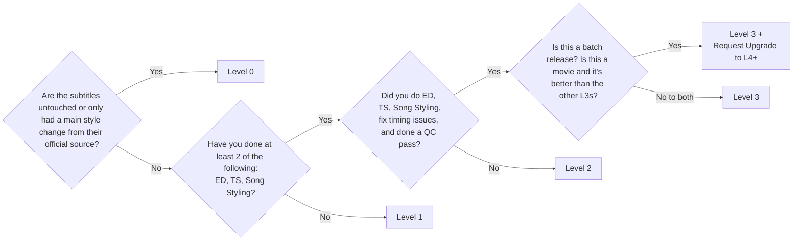

# Sub Levels

Sub levels is how nekoBT attempts to categorize the **quality** of a release's subtitles. 
The higher the sub level, the better the quality of the subtitles. 

The sub levels are as follows:
- **Level 0 (L0)**: Official subtitles
    - These are official subtitles taken from a source.
        - Examples: Netflix, Crunchyroll, Blu-ray, etc.
    - Edits to the main style are considered as "minor changes", and would still be L0.
- **Level 1 (L1)**: Basic fansubs
    - Any modified subtitles that goes further than just changing the style.
- **Level 2 (L2)**: Mid-tier fansubs
    - Requires two of the following: ED, TS, or Song Styling.
- **Level 3 (L3)**: High quality fansubs
    - Requires all of the following: ED, TS, Song Styling, fixed timing issues, and QC.
- **Level 4-9 (L4-L9)**: Batch releases
    - These levels are reserved for batch releases, and can only be awarded by staff.
        - To get L4+ on a release, report the torrent under the "Request Level Increase for Batch" category.
    - Must meet L3 requirements.
    - Contains batch fixes, such as typos, missing typesetting, etc.
    - A release can obtain a higher level than other batch releases by being higher quality.
        - Quality is slightly subjective, but it *usually* does not depend on the encode quality, as this is categorized by Video Type.
    - For movies, L4 is only used to mark upgrades in quality compared to other L3 releases.

!!!info Edge case:
If an episode can't have a certain job done, then you can count it as being done. 
Example 1: If an episode has no songs, then you can count Song Styling as being done. 
Example 2: If an episode has no signs, then you can count TS as being done. 
However, just because an episode has no songs or signs, doesn't automatically make it L2. 
If you have done other jobs (TLC, QC, etc), then you can make it L2.
!!!

Here's a flow chart to help you categorize your release's sub level:

### Appendix
- **ED**: Editing — making changes to the script to make it read well.
- **TS**: Typesetting — turning foreign signs (text on screen) into your language.
- **QC**: Quality Check — checking everyone's work for errors, typos, etc.
- **TLC**: Translation Check — checking the translation for accuracy.
