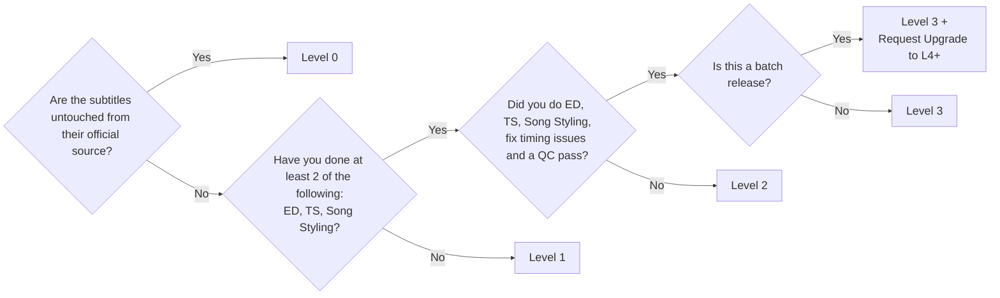

# Sub Levels

Sub levels is how nekoBT attempts to categorize the **quality** of a release's subtitles. 
The higher the sub level, the better the quality of the subtitles. 

The sub levels are as follows:
- **Level 3 (L3)**
    - Generally, the best quality fansubs.
    - Required: ED, TS, Song Styling, fixed timing issues, QC.
- **Level 2 (L2)**
    - Mid-tier fansubs.
    - Two of the following: ED, TS, Song Styling.
- **Level 1 (L1)**
    - Basic fansubs, minor changes from official sources.
- **Level 0 (L0)**: Official subtitles.
    - These are the official subtitles provided by the source.
        - Examples: Netflix, Crunchyroll, Blu-ray, etc.
- **Level 4-9 (L4-L9)**: Batch releases.
    - These levels are reserved for batch releases, and can only be awarded by staff.
        - To get L4+ on a release, report the torrent under the "Request Level Increase for Batch" category.
    - Must meet L3 requirements.
    - Contains batch fixes, such as typos, missing typesetting, etc.
    - A release can obtain a higher level than other batch releases by being higher quality.
        - Quality is slightly subjective, but it *usually* does not depend on the encode quality, as this is categorized by Video Type.

Here's a flow chart to help you categorize your release's sub level:

### Appendix
- **ED**: Editing, making changes to the script to make it read well.
- **TS**: Typesetting, turning foreign signs (text on screen) into your language.
- **QC**: Quality Check, checking everyone's work for errors, typos, etc.